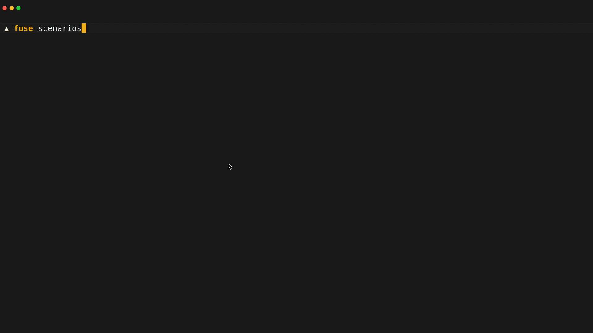

<br/>
<p align="center">
  <a href="https://botkube.io/fuse">
    <picture>
      <source media="(prefers-color-scheme: dark)" srcset="./docs/assets/fuse-logo-dark.svg">
      <source media="(prefers-color-scheme: light)" srcset="./docs/assets/fuse-logo-light.svg">
      
    </picture>
  </a>
</p>

<p align="center">
  Switch Between Your Needs – Not Your Tools
</p>
</p>

## Overview

AI-powered expertise with deep domain knowledge at your fingertips; Botkube Fuse delivers tailored guidance for your unique infrastructure, pipelines, and services.

📖 Read more about Botkube FUse features on [the official website](https://botkube.io/fuse/).


## Usage

After downloading the CLI, you can start experimenting right away!

### Chat mode

To start a session in chat mode, simply run:

```shell
fuse
```

### Inline prompting

> [!TIP]
> When using inline mode, enclose your prompt in single quotation marks (') to prevent your shell from interpreting it.

Fuse CLI also supports inline mode, allowing you to execute prompts directly. Run:

```shell
fuse 'list files in the current directory and provide me better organization structure'
```

### 💡 Looking for inspiration?

If you are curious what Fuse can do for you, simply run `fuse scenarios` in your terminal!



## Installation

### macOS & Linux

Fuse is available via [Homebrew](https://brew.sh) and as a downloadable binary from the [releases page](https://github.com/kubeshop/fuse-releases/releases).

#### Homebrew

| Install                                    | Upgrade                                    |
|--------------------------------------------|--------------------------------------------|
| `brew install kubeshop/fuse-releases/fuse` | `brew upgrade kubeshop/fuse-releases/fuse` |

<details><summary><strong>Using <code>curl</code> on Linux</strong></summary>
<p>


Download the Fuse CLI binary and move it to a directory in your `$PATH`:

```shell
curl -Lo fuse https://github.com/kubeshop/fuse-releases/releases/latest/download/fuse-linux-amd64
chmod +x fuse && mv fuse /usr/local/bin/fuse
```

> [!NOTE]
> You may need to use sudo to run the mv command as it moves the binary file to the `/usr/local/bin/` directory.

</p>
</details> 

### Windows

Use [curl](https://curl.se/windows/) to download the Fuse CLI binary:

```shell
curl -Lo fuse https://github.com/kubeshop/fuse-releases/releases/latest/download/fuse-windows-amd64.exe
```

Move the binary to a directory in your `%PATH%`.

<details><summary><strong>Other Platforms</strong></summary>
<p>


Download the Fuse CLI binary and move it to a directory in your `$PATH`/`%PATH%`:

```shell
export OS=<your-os> # allowed values: darwin, linux, windows
export ARCH=<your-arch> # allowed values: amd64, arm64, armv7
export SUFFIX="" # set to ".exe" if OS is 'windows'
curl -Lo fuse https://github.com/kubeshop/fuse-releases/releases/latest/download/fuse-${OS}-${ARCH}${SUFFIX}
chmod +x fuse && mv fuse /usr/local/bin/fuse
```

</p>
</details> 
